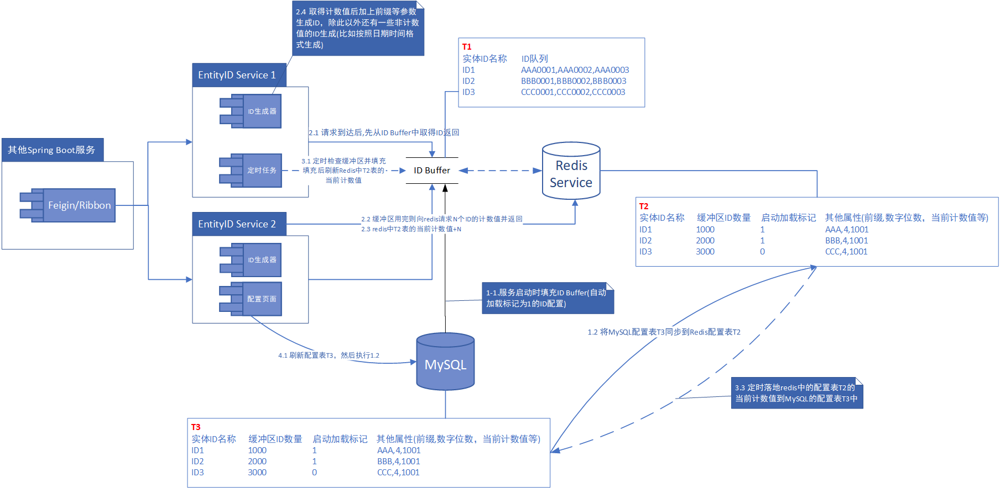
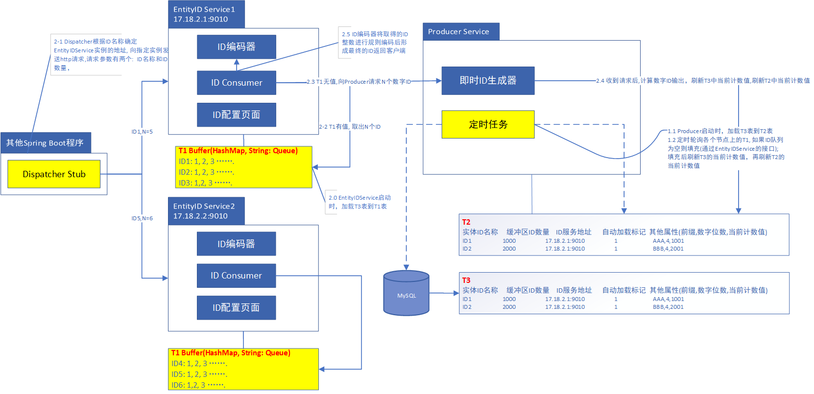

实体ID在业务系统的数据库设计中是比较重要的元素，每个业务实体拥有一个唯一的实体ID并籍此与其他实体发生关系，进行数据交互。在我们的系统中，实体ID需要具备全局唯一性，除了Java8的GUID方案外，我们想到了实体ID服务这个可选方案，这个方案的优点在于：
1.  ID的格式可以自定义，可以生成较复杂的ID, 可读性比GUID强
2.  高并发环境下ID不会重复
3.  可扩展，更适合分布式环境
4.  提供可视化的配置界面
规格方面的要求是ID生成保持格式一致性，递增性，唯一性, 高性能

实体ID在业务系统的数据库设计中是比较重要的元素，实体ID服务提供了Java8的GUID之外的另一个可选方案，具有ID格式一致性，递增性，唯一性和高性能的特点。

### 架构方案一

### 架构方案二

