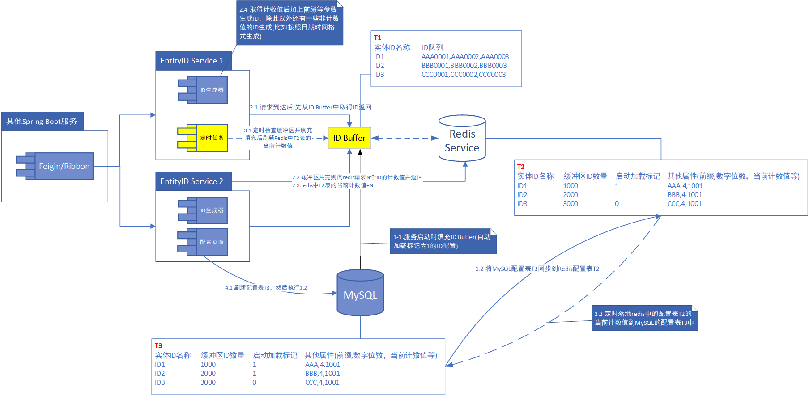
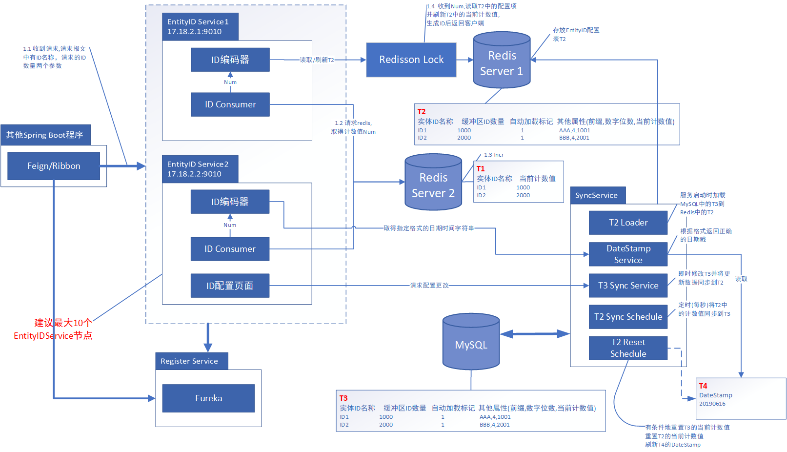
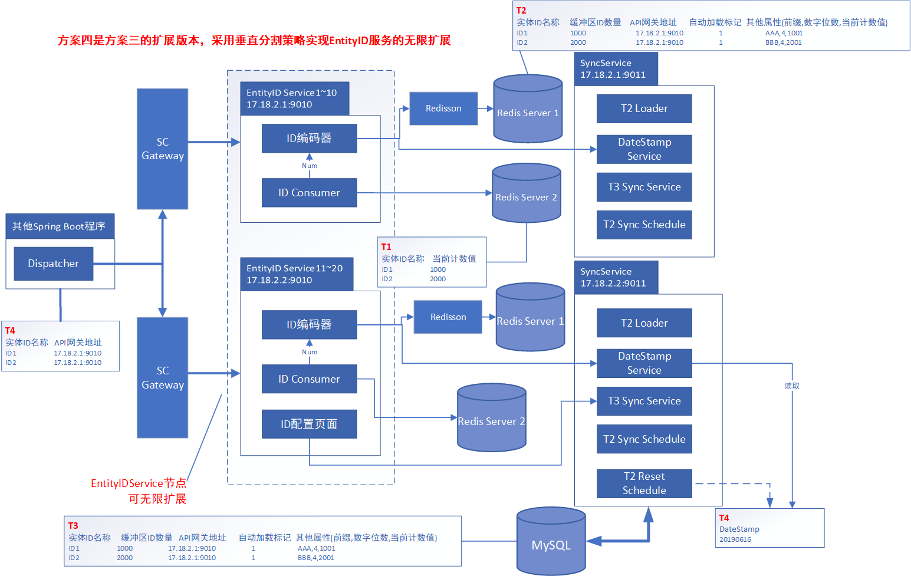

实体ID在业务系统的数据库设计中是比较重要的元素，每个业务实体拥有一个唯一的实体ID并籍此与其他实体发生关系，进行数据交互。在我们的系统中，实体ID需要具备全局唯一性，同时能够具备多种ID格式输出。而市面上的雪花算法产生长整型ID，Java等高级语言的函数产生的GUID都满足不了更高级的需求，而且没有构成完整的系统方案。因此，我们想到了分布式实体ID服务这个可选方案。这个方案的优点在于：

1.  ID的格式可以自定义，可以生成较复杂的ID, 可读性比GUID强
2.  高并发环境下ID不会重复
3.  可扩展，更适合分布式环境
4.  提供可视化的配置界面
5.  规格方面的要求是ID生成保持格式一致性，递增性，唯一性, 高性能。在2w以上QPS，百万以上实体类型的环境下依然能够保持上述特性。

本系统提供更多的ID生成器功能，适用于分布式系统环境，大型电商网站，Saas系统，企业内部ERP系统等都可以适用该方案。
系统采用了分布式微服务技术栈来构成服务主体，使用了分布式锁等技术来保障服务内部写入操作的安全性，集成redis cluster来提供整数计数器的安全运算。

### 架构方案一

### 架构方案二

### 架构方案三

### 架构方案四

